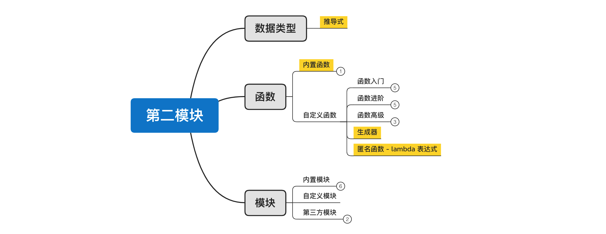
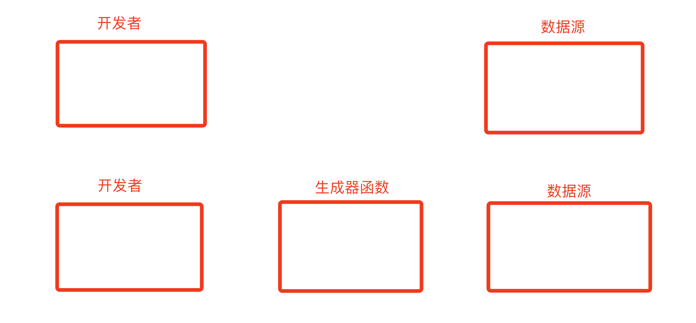
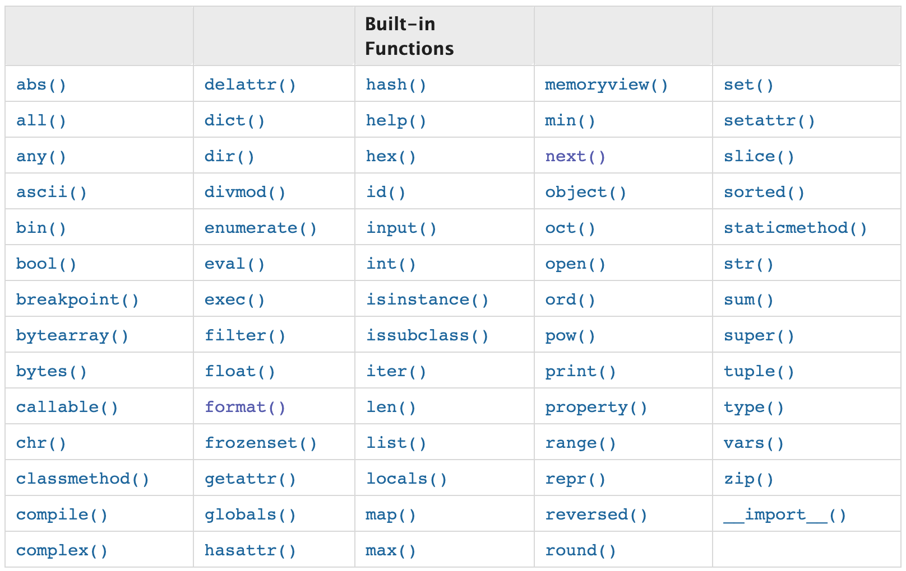
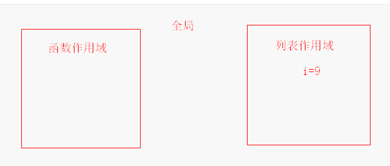
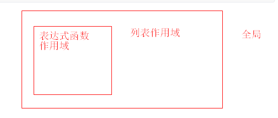

# day13 内置函数和推导式

 

今日概要：

- 匿名函数
- 生成器
- 内置函数
- <span style='color:red;'>**附加**</span>：推导式，属于数据类型的知识，内部的高级的用法会涉及到【生成器】和【函数】的知识。


## 1. 匿名函数

传统的函数的定义包括了：函数名 + 函数体。

```python
def send_email():
    pass

# 1. 执行 #p 用：函数名 + ()
send_email()
# 2. 当做列表元素 #p 是把函数名作为列表（字典、集合、元组均可）元素
data_list = [send_email, send_email, send_email ]
# 3. 当做参数传递 #p 是把函数名作为参数传递
other_function(send_email)
```


匿名函数，则是基于lambda表达式实现定义一个可以**没有名字的函数**，例如：

```python
#p 下面的三个列表元素就是三个匿名函数
data_list = [ lambda x:x+100,  lambda x:x+110, lambda x:x+120 ]

print( data_list[0] )
```

```python
f1 = lambda x:x+100    #p 给匿名函数取名为f1函数，这样就可以执行该函数了

res = f1(100)
print(res)
```


基于Lambda定义的函数格式为：`lambda 参数:函数体`  

#p 基于Lambda定义的匿名函数的定义格式，三部分：关键字    参数    :函数体

- 参数，支持任意参数。

  ```python
  lambda x: 函数体  #p lambda是关键字
  lambda x1,x2: 函数体
  lambda *args, **kwargs: 函数体
  ```

- 函数体，只能支持单行的代码。

  ```python
  def xxx(x):
      return x + 100
      
  lambda x: x + 100  #p 等价上面两行
  ```

- 返回值，默认将函数体单行代码执行后的结果返回。

  ```python
  func = lambda x: x + 100
  
  v1 = func(10)
  print(v1) # 110
  ```


```python
def func(a1,a2):
    return a1 + a2 + 100

foo = lambda a1,a2: a1 + a2 + 100
```

匿名函数适用于简单的业务处理，可以快速并简单的创建函数。

### 练习题

根据函数写写出其匿名函数的表达方式

```python
def func(a1,a2):
    return a1 + a2

func = lambda a1,a2: a1+a2
```

```python
def func(data):
    return data.replace("苍老师","***")

func= lambda data: data.replace("苍老师","***")
```

```python
def func(data):
    name_list = data.replace(".") #p 这里应该不是replace方法
    return name_list[-1]

func = lambda data: data.replace(".")[-1]
```

在编写匿名函数时，由于受限 函数体只能写一行，所以匿名函数只能处理非常简单的功能。


### 扩展：三元运算

简单的函数，可以基于lambda表达式实现。

简单的条件语句，可以基于三元运算实现，例如：

```python
num = input("请写入内容")

if "苍老师" in num:
    data = "臭不要脸"
else:
    data = "正经人"
    
print(data)
```

```python
num = input("请写入内容")
data = "臭不要脸" if "苍老师" in num else "正经人"
print(data)

# 结果 =  条件成立时    if   条件   else   不成立
```

lambda表达式和三元运算没有任何关系，属于两个独立的知识点。


掌握三元运算之后，以后再编写匿名函数时，就可以处理再稍微复杂点的情况了，例如：

```python
func = lambda x: "大了" if x > 66 else "小了"

v1 = func(1)
print(v1) # "小了"

v2 = func(100)
print(v2) # "大了"
```


## 2. 生成器

生成器是由函数+yield关键字创造出来的写法，在特定情况下，用他可以帮助我们节省内存。

- 生成器函数，但函数中有yield存在时，这个函数就是生产生成器函数。

  ```python
  def func():
      print(111)
      yield 1 
  ```

  ```python
  def func():
      print(111)
      yield 1
  
      print(222)
      yield 2
  
      print(333)
      yield 3
  
      print(444)
  ```

- 生成器对象，执行生成器函数时，会返回一个生成器对象。

  ```python
  def func():
      print(111)
      yield 1
  
      print(222)
      yield 2
  
      print(333)
      yield 3
  
      print(444)
      
  data = func()
  print(data)   #p <generator object func at 0x0000025A86A1B510>
  # 执行生成器函数func，返回的是生成器对象。
  # 注意：执行生成器函数时，函数内部代码不会执行。
  ```

  ```python
  def func():
      print(111) #p 一旦使用了next()，就开始执行，
      yield 1    #p 这句类似return语句(返回 1)，执行到这个位置之后就不再执行。
  
      print(222)
      yield 2
  
      print(333)
      yield 3
  
      print(444)
      
  data = func()
  
  #p next()里面放生成器对象；next()作用：进入生成器函数并执行其中的代码(从上次yield返回位置继续向下执行)，且next()返回值就是当前这段执行代码最后的yield 后面的值。
  v1 = next(data) 
  print(v1)
  
  v2 = next(data)
  print(v2)
  
  v3 = next(data)
  print(v3)
  
  v4 = next(data) 
  print(v4)  # 结束或中途遇到return，程序爆：StopIteration 错误
  ```
  
  ```python
  #p 用for循环执行生成器对象，就不会出现上面的StopIteration错误
  data = func()
  
  for item in data: #p 类似多次执行：item = next(data)，结果与上面相同但不会报错。
      print(item)
  ```


生成器的特点是，记录在函数中的执行位置，下次执行next时，会从上一次的位置基础上再继续向下执行。


### 应用场景

- 假设要让你生成 300w个随机的4位数，并打印出来。

  - 在内存中一次性创建300w个
  - 动态创建，用一个创建一个。

  ```python
  import random
  
  val = random.randint(1000, 9999)
  print(val)
  ```

  ```python
  import random
  
  data_list = []
  for i in range(300000000):
      val = random.randint(1000, 9999)
  	data_list.append(val)
      
  # 再使用时，去 data_list 中获取即可。
  # ...
  ```

  ```python
  import random
  
  
  def gen_random_num(max_count):
      counter = 0
      while counter < max_count:
          yield random.randint(1000, 9999)
          counter += 1
  
  
  data_list = gen_random_num(3000000)
  # 再使用时，去 data_list 中获取即可。
  ```

- 假设让你从某个数据源中获取300w条数据（后期学习操作MySQL 或 Redis等数据源再操作，了解思想即可）。



所以，当以后需要我们在内存中创建很多数据时，可以想着用基于生成器来实现一点一点生成（用一点生产一点），以**节省内存**的开销。


### 扩展

```python
def func():
    print(111)
    v1 = yield 1
    print(v1)

    print(222)
    v2 = yield 2
    print(v2)

    print(333)
    v3 = yield 3
    print(v3)

    print(444)


data = func()

n1 = data.send(None)
print(n1)

n2 = data.send(666)
print(n2)

n3 = data.send(777)
print(n3)

n4 = data.send(888)
print(n4)
```


## 3.内置函数



Python内部为我们提供了很多方便的内置函数，在此整理出来36个给大家来讲解。

- 第1组（5个）

  - abs，绝对值

    ```python
    v = abs(-10)
    ```

  - pow，指数

    ```python
    v1 = pow(2,5) # 2的5次方  2**5
    print(v1)
    ```

  - sum，求和

    ```python
    #p sum里面只要传的是可以被迭代的对象(嵌套的不行)就可以。如列表、元组等等
    v1 = sum([-11, 22, 33, 44, 55]) 
    print(v1)
    ```

  - divmod，求商和余数

    ```python
    v1, v2 = divmod(9, 2)
    print(v1, v2)
    ```

  - round，保留小数点后n位（四舍五入）

    ```python
    v1 = round(4.11786, 2)
    print(v1) # 4.12
    ```

- 第2组：（4个）

  - min，最小值

    ```python
    v1 = min(11, 2, 3, 4, 5, 56) #p 这个sum是不行的。11, 2, 3, 4, 5, 56 不是可迭代对象
    print(v1) # 2
    ```

    ```
    v2 = min([11, 22, 33, 44, 55]) # 可迭代对象
    print(v2)
    ```

    ```python
    #p 对可迭代对象中的所有元素执行某函数，找到其中的最小值，并返回该最小值原来的值。
    v3 = min([-11, 2, 33, 44, 55], key=lambda x: abs(x)) 
    print(v3) # 2
    ```

  - max，最大值

    ```python
    v1 = max(11, 2, 3, 4, 5, 56)
    print(v1)
    
    v2 = max([11, 22, 33, 44, 55])
    print(v2)
    ```

    ```python
    #p 对可迭代对象中的所有元素执行某函数，找到其中的最大值，并返回该最大值原来的值。
    v3 = max([-11, 22, 33, 44, 55], key=lambda x: x * 10)
    print(v3) # 55
    ```

  - all，是否全部为True

    ```python
    v1 = all(   [11,22,44,""]   ) # False # 可迭代对象
    ```

  - any，是否存在True

    ```python
    v2 = any([11,22,44,""]) # True # 可迭代对象
    ```

    

- 第3组（3个）

  - bin，十进制转二进制
  - oct，十进制转八进制
  - hex，十进制转十六进制

- 第4组（2个）

  - ord，获取字符对应的unicode码点（十进制）

    ```python
    v1 = ord("武")  #p v1是十进制的
    print(v1, hex(v1))
    ```

  - chr，根据码点（十进制）获取对应字符

    ```python
    v1 = chr(27494)
    print(v1)
    ```

- 第5组（9个）

  - int

  - float

  - str，unicode编码

  - bytes，utf-8、gbk编码

    ```python
    v1 = "武沛齐"  # str类型 #p str类型是unicode编码
    v2 = v1.encode('utf-8')  # 将str类型转换为bytes类型  #p bytes类型是utf-8编码
    v3 = bytes(v1,encoding="utf-8") #p 也可以将str类型转换为bytes类型
    ```
    
  - bool

  - list

  - dict

  - tuple

  - set

- 第6组（13个）

  - len

  - print

  - input

  - open

  - type，获取数据类型

    ```python
    v1 = "123"
    
    if type(v1) == str:
        pass
    else:
        pass
    ```

  - range 

    ```python
    range(10) #p 0-9
    ```

  - enumerate

    ```python
    v1 = ["武沛齐", "alex", 'root']
    
    for num, value in enumerate(v1, 2):
        print(num, value)
    #p   2 武沛齐
    #p   3 alex
    #p   4 root
    ```
  
  - id    #p 获取内存地址
  
  - hash   #p 相当于把字符串用一个数字表示
  
    ```python
    v1 = hash("武沛齐") #p 取字符串"武沛齐"的哈希值
    ```
  
  - help，帮助信息

    - pycharm，#p ctrl + 鼠标右键 可直接进入源码看。
    - 终端，使用
  
    ```python
    import random 
    help(random)
    
    help(str)
    ```
  
  - zip

    ```python
    v1 = [11, 22, 33, 44, 55, 66]
    v2 = [55, 66, 77, 88]
    v3 = [10, 20, 30, 40, 50]
    
    #p zip()后会生成一个可迭代对象(<zip object at 0x000001665AC60200>)，通过for循环可以打印出其中的值
    result = zip(v1, v2, v3) 
    for item in result:
        print(item)
    #p (11, 55, 10)
    #p (22, 66, 20)
    #p (33, 77, 30)
    #p (44, 88, 40)
    ```
  
  - callable，是否可执行，目前可理解为后面是否可以加括号，后面学了面向对象后还有一些其他的也可以。
  
    ```python
    v1 = "武沛齐"
    v2 = lambda x: x
    def v3():
        pass
    
    
    print( callable(v1) ) # False
    print(callable(v2)) # True
    print(callable(v3)) # True
    ```
  
  - sorted，排序
  
    ```python
    #p 内置函数提供的排序
    v1 = sorted([11,22,33,44,55], reverse = True) #p 倒序排列
    
    #p 列表内部的方法
    v1 = [11,22,33,44,55]
    v1.sort(reverse = True) #p 但这个会改变原来的列表，而内置函数会生成新的列表
    ```
  
    ```python
    #p 嵌套的字典
    info = {
        "wupeiqi": {
            'id': 10,
            'age': 119
        },
        "root": {
            'id': 20,
            'age': 29
        },
        "seven": {
            'id': 9,
            'age': 9
        },
        "admin": {
            'id': 11,
            'age': 139
        },
    }
    v1 = sorted(info, reverse = True) #p 提取外层的字典的键进行排序
    #p items方法会把字典的键和值作为一个元组放入列表中： dict_items([("wupeiqi", {...}),(root", {...}),...])，sorted内置函数可以获得该列表。
    #p 函数lambda x: x[1]['id']是对元素x的操作(可迭代对象的每个元素会传给参数x)；即对每个元素的第二个元素的键'id'的值进行排序。
    result = sorted(info.items(), key=lambda x: x[1]['id'])
    print(result)
    #p 输出：[('seven', {'id': 9, 'age': 9}), ('wupeiqi', {'id': 10, 'age': 119}), ('admin', {'id': 11, 'age': 139}), ('root', {'id': 20, 'age': 29})]
    ```
    
    ```python
    data_list = [
        '1-5 编译器和解释器.mp4',
        '1-17 今日作业.mp4',
        '1-9 Python解释器种类.mp4',
        '1-16 今日总结.mp4',
        '1-2 课堂笔记的创建.mp4',
        '1-15 Pycharm使用和破解（win系统）.mp4',
        '1-12 python解释器的安装（mac系统）.mp4',
        '1-13 python解释器的安装（win系统）.mp4',
        '1-8 Python介绍.mp4', '1-7 编程语言的分类.mp4',
        '1-3 常见计算机基本概念.mp4',
        '1-14 Pycharm使用和破解（mac系统）.mp4',
        '1-10 CPython解释器版本.mp4',
        '1-1 今日概要.mp4',
        '1-6 学习编程本质上的三件事.mp4',
        '1-18 作业答案和讲解.mp4',
        '1-4 编程语言.mp4',
        '1-11 环境搭建说明.mp4'
    ]
    result = sorted(data_list) #p 对每个元素的字符依次排序。
    #p 字符串的split方法会分割成多个字符串，int也是一个关键点。
    result = sorted(data_list, key=lambda x: int(x.split(' ')[0].split("-")[-1]) )
    print(result)
    ```


## 4.推导式

推导式是Python中提供了一个非常方便的功能，可以让我们通过一行代码实现**创建list、set 、dict、tuple并初始化一些值**。

请创建一个列表，并在列表中初始化：0、1、2、3、4、5、6、7、8、9...299 整数元素。

```python
#p 推导式有条件语句
data = []
for i in range(300):
    if 表达式：
    	data.append(x)   #p x就是for前面的表达式
        
#p 推导式中没有条件语句
data = []
for i in range(300):
    data.append(x)       #p x就是for前面的表达式

    
    data = []
for i in range(300):
    data.append(i)
```

- 列表

  ```python
  num_list = [ i for i in range(10)]
  
  num_list = [ [i,i] for i in range(10)]
  
  num_list = [ [i,i] for i in range(10) if i > 6 ]
  num_list = [ "武沛齐-{}".format(i) for i in range(10) if i > 6 ]
  ```

- 集合

  ```python
  # 集合里面的元素不能是列表，因为列表不可哈希
  #p range() 函数返回的结果是一个整数列表的可迭代对象，但不是列表，可用list()函数生成列表。
  num_set = { i for i in range(10)}
  
  num_set = { (i,i,i) for i in range(10)}
  
  num_set = { (i,i,i) for i in range(10) if i>3}
  ```

- 字典

  ```python
  num_dict = { i:i for i in range(10)} #p .append(键值对)
  
  num_dict = { i:(i,11) for i in range(10)} #p {0: (0, 11), 1: (1, 11), 2: (2, 11),...}
  
  num_dict = { i:(i,11) for i in range(10) if i>7}
  # 同样也支持字符串格式化。字典的键也是要可哈希的
  ```

- 元组，<span style="color:red">不同于其他类型。</span>

  ```python
  # 不会立即执行内部循环去生成数据，而是得到一个生成器。
  data = (i for i in range(10))
  print(data) #p <generator object <genexpr> at 0x000001EBB6B15F90>
  for item in data: #p 生成器，可以用for循环获取其中的值
      print(item)
  ```


### 练习题

1. 去除列表中每个元素的 `.mp4`后缀。

   ```python
   data_list = [
       '1-5 编译器和解释器.mp4',
       '1-17 今日作业.mp4',
       '1-9 Python解释器种类.mp4',
       '1-16 今日总结.mp4',
       '1-2 课堂笔记的创建.mp4',
       '1-15 Pycharm使用和破解（win系统）.mp4',
       '1-12 python解释器的安装（mac系统）.mp4',
       '1-13 python解释器的安装（win系统）.mp4',
       '1-8 Python介绍.mp4', '1-7 编程语言的分类.mp4',
       '1-3 常见计算机基本概念.mp4',
       '1-14 Pycharm使用和破解（mac系统）.mp4',
       '1-10 CPython解释器版本.mp4',
       '1-1 今日概要.mp4',
       '1-6 学习编程本质上的三件事.mp4',
       '1-18 作业答案和讲解.mp4',
       '1-4 编程语言.mp4',
       '1-11 环境搭建说明.mp4'
   ]
   # 推导式方法
   result = []
   for item in data_list: #p 对于可迭代对象中的元素操作，优先考虑for循环
       result.append(item.rsplit('.',1)[0]) #p rsplit()或split()方法生成的都是把分开的字符串放入列表，但后面加了[0]，就是列表的元素了，是字符串类型了，不再是列表类型了。
   # 推导式方法
   result = [ item.rsplit('.',1)[0] for item in data_list]
   ```

2. 将字典中的元素按照 `键-值`格式化，并最终使用 `;`连接起来。

   ```python
   info = {
       "name":"武沛齐",
       "email":"xxx@live.com",
       "gender":"男",
   }
   # 循环的方法
   data_list = [] 
   for k,v in info.items():
       temp = "{}-{}".format(k,v)
       data_list.append(temp)
   result = ";".join(data_list) #p join方法：用指定字符串拼接序列(字符串、列表这些应该都可以称为序列)的元素。
   # 推导式方法
   result = ";".join( [ "{}-{}".format(k,v) for k,v in info.items()] )
   #p 输出：name-武沛齐;email-xxx@live.com;gender-男
   ```

3. 将字典按照键从小到大排序，然后在按照如下格式拼接起来。（微信支付API内部处理需求）

   ```python
   info = {
       'sign_type': "MD5",
       'out_refund_no': "12323",
       'appid': 'wx55cca0b94f723dc7',
       'mch_id': '1526049051',
       'out_trade_no': "ffff",
       'nonce_str': "sdfdffd",
       'total_fee': 9901,
       'refund_fee': 10000
   }
   #p 推导式+排序+拼接
   data = "&".join(["{}={}".format(key, value) for key, value in sorted(info.items(), key=lambda x: x[0])])
   print(data)
   ```

4. 看代码写结果

   ```python
   # 普通的函数定义
   def func():
       print(123)
   # lambda表达式的函数定义
   lambda x：x+10
   
   data_list = [func for i in range(10)] #p 这两个函数都没有执行；注意函数有没有返回值
   data_list = [ lambda ：100 for i in range(10)]#p lambda ：100：函数的返回值是100
   
   print(data_list)
   ```

5. 看代码写结果

   ```python
   def func(num):
       return num + 100
   
   
   data_list = [func(i) for i in range(10)]
   
   print(data_list)
   ```

6. 看代码写结果（执行出错，通过他可以让你更好的理解执行过程）

   ```python
   def func(x):
       return x + i
   
   data_list = [func for i in range(10)]
   
   val = data_list[0](100)
   print(val)
   ```

   #p 

7. 看代码写结果（新浪微博面试题）

   ```python
   data_list = [lambda x: x + i for i in range(10)]  # [函数,函数,函数]   i=9
   
   v1 = data_list[0](100)
   v2 = data_list[3](100)
   print(v1, v2)  # 109 109
   ```

   #p 

### 小高级

1. 推导式支持嵌套

   ```python
   data = [ i for i in range(10)]
   ```

   ```python
   data = [ (i,j) for j in range(5) for i in range(10)]#p 后面的循环先执行
   #p 普通写法如下：两层for后再用append方法
   data = []
   for i in range(10):
       for j in range(5):
           data.append( (i,j) )
   
   data = [ [i, j] for j in range(5) for i in range(10)] #p (i,j)这里可以是列表等等。
   ```

   ```python
   # 一副扑克牌
   
   poker_list = [ (color,num) for num in range(1,14) for color in ["红桃", "黑桃", "方片", "梅花"]]
   
   poker_list = [ [color, num] for num in range(1, 14) for color in ["红桃", "黑桃", "方片", "梅花"]]
   
   print(poker_list)	
   ```

2. 烧脑面试题

   ```python
   def num():
       return [lambda x: i * x for i in range(4)]
   
   
   # 1. num()并获取返回值  [函数,函数,函数,函数] i=3
   # 2. for循环返回值
   # 3. 返回值的每个元素(2)
   result = [m(2) for m in num()]  # [6,6,6,6]
   print(result)
   
   ```

   ```python
   def num():
       return (lambda x: i * x for i in range(4))
   
   
   # 1. num()并获取返回值  生成器对象
   # 2. for循环返回值
   # 3. 返回值的每个元素(2)
   result = [m(2) for m in num()]  # [0,2,4,6 ]
   print(result)
   ```

   

## 总结

1. 匿名函数，基于lambda表达式实现一行创建一个函数。一般用于编写简单的函数。
2. 三元运算，用一行代码实现处理简单的条件判断和赋值。
3. 生成器，函数中如果yield关键字
   - 生成器函数
   - 生成器对象
   - 执行生成器函数中的代码
     - next
     - for（常用）
     - send
4. 内置函数（36个）
5. 推导式
   - 常规操作
   - 小高级操作

## 作业

1. 看代码写结果

   ```
   v = [ lambda :x  for x in range(10)] 
   print(v)
   print(v[0])
   print(v[0]())
   ```

2. 看代码写结果

   ```
   v = [i for i in range(10,0,-1) if i > 5]
   print(v)
   ```

3. 看代码写结果

   ```python
   data = [lambda x:x*i for i in range(10)]
   print(data)
   print(data[0](2))
   print(data[0](2) == data[8](2))
   ```

4. 请用列表推导式实现，踢出列表中的字符串，最终生成一个新的列表保存。

   ```python
   data_list = [11,22,33,"alex",455,'eirc']
   
   new_data_list = [ ... ] # 请在[]中补充代码实现。
   
   # 提示：可以用type判断类型
   ```

5. 请用列表推导式实现，对data_list中的每个元素判断，如果是字符串类型，则计算长度作为元素放在新列表的元素中；如果是整型，则让其值+100 作为元素放在新的列表的元素中。

   ```python
   data_list = [11,22,33,"alex",455,'eirc']
   
   new_data_list = [ ... ] # 请在[]中补充代码实现。
   
   # 提示：可以基于三元运算实现
   ```

6. 请使用字典推导式实现，将如果列表构造成指定格式字典.

   ```python
   data_list = [
       (1,'alex',19),
       (2,'老男',84),
       (3,'老女',73)
   ]
   
   # 请使用推导式将data_list构造生如下格式：
   """
   info_dict = {
       1:(1,'alex',19),
       2:(2,'老男',84),
       3:(3,'老女',73)
   }
   """
   ```

7. 有4个人玩扑克牌比大小，请对比字典中每个人的牌的大小，并输入优胜者的姓名（值大的胜利，不必考虑A）。

   ```python
   player = {
       "武沛齐":["红桃",10],
       "alex":["红桃",8],
       'eric':["黑桃",3],
       'killy':["梅花",12],
   }
   ```

8. 尽量多的列举你记得的内置函数？【能记住多少就写多少，不强制去背，在此尽权利写即可，这种公共后续用的多了就自然而然就记住了】

9. 请编写一个生成器函数实现生成n个斐波那契数列的值。

   - 什么是斐波那契数列？

     ```
     前两个数相加的结果，就是下一个数。
     1 1 2 3 5 8 13 21 34 55 ...
     ```

   - 代码结构示例，请在此基础上补充代码实现。

     ```python
     def fib(max_count):
         pass
     
     
     count = input("请输入要生成斐波那契数列的个数：")
     count = int(count)
     fib_generator = fib(count)
     for num in fib_generator:
         print(num) 
     ```

     

   


