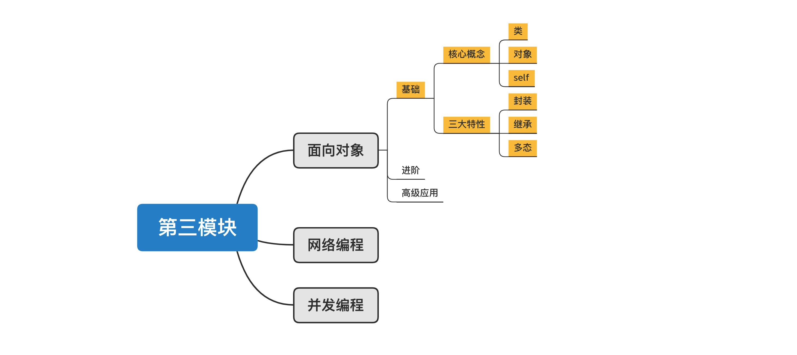
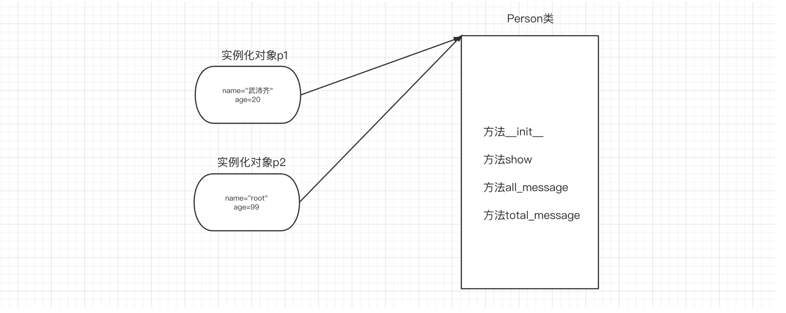
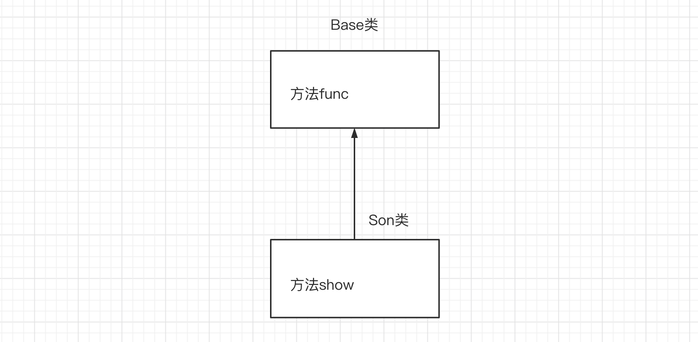
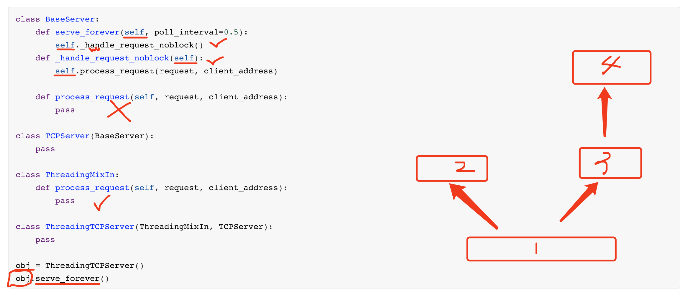

# 第三模块 面向对象&网络&并发编程


从今天开始，我们将进入系列课程第3个模块的的学习，此模块包含如下三大部分知识：

- 面向对象，Python中支持两种编程方式来写代码，分别是：`函数式编程`、`面向对象式编程`。

  - 函数式编程

    ```python
    #p 先定义函数(在函数中实现功能)，再执行函数。
    # 定义函数，在函数中实现功能
    def func():
    	print("一个NB的功能")
    
    # 执行函数
    func()
    ```

  - 面向对象式编程

    ```python
    #p 先定义类(在类中定义方法实现功能)，再实例化类对象，再执行类中的方法
    # 定义类
    class Foo(object):
        # 在类中定义方法
        def func(self):
            print("一个NB的功能")
        
    # 实例化类的对象
    obj = Foo()
    # 执行类中的方法
    obj.func()
    ```

  Python支持两种编程方式（其他很多语言只支持一种），所以初学者在刚开始学习往往不知道应如何选择，并且行业内对于 函数式编程 vs 面向对象编程 之间谁更好的讨论也是难分胜负，其实在开发中无论要实现什么样的功能，两种编程模式都能实现，哪种让我们能更好实现就选择谁？不必非纠结于哪种方式更好，编程语言支持工具，最重要的是把功能实现。

  

  初学者在选择编程方式时候，可以遵循如下规则：

  - 函数式，推荐初学者使用。理由：上手快且逻辑简单清晰。

  - 面向对象，推荐有一些代码经验后使用。理由：面向对象的思想需要有一定的项目积累之后（写多了&看的多）才能真正理解其精髓，基于面向对象可以编写出扩展性更强的代码（在一定程序上也可以简化代码）。

    

  现阶段，大家在学习面向对象时更重要的是：掌握相关知识点 & 读懂源码 & 编写简单的基于面向对象的程序。

  

- 网络编程，学习网络知识后，可以让我们的程序通过网络来进行数据交互和传输 并 掌握其本质。

  

- 并发编程，一个程序想要执行的速度更快是必须要掌握并发编程的相关知识。

  ```
  例如：下载10个抖音视频，每个需要2分钟。
  - 按照以前的思路，逐一下载就需要20分钟。
  - 按照并发的思路，创建10个线程/进程来实现，大概需要2分钟就可以完成。
  ```

  


# day17 面向对象基础



课程目标：了解面向对象并可以根据面向对象知识进行编写代码。

课程概要：

- 初识面向对象
- 三大特性（面向对象）
  - 封装
  - 继承
  - 多态
- 再看数据类型


## 1. 初识面向对象

想要通过面向对象去实现某个或某些功能时需要2步：

- 定义类，在类中定义方法，在方法中去实现具体的功能。

- 实例化类并的个一个对象，通过对象去调用并执行方法。


```python
class Message:

    def send_email(self, email, content):
        data = "给{}发邮件，内容是：{}".format(email,content)
        print(data)


msg_object = Message() # 实例化一个对象 msg_object，创建了一个一块区域。
msg_object.send_email("wupeiqi@live.com","注册成功")
```

注意：1.类名称首字母大写&驼峰式命名；2.py3之后默认类都继承object；3.在类种编写的函数称为方法；4.每个方法的第一个参数是self。


类中可以定义多个方法，例如：

```python
class Message:

    def send_email(self, email, content):
        data = "给{}发邮件，内容是：{}".format(email, content)
        print(data)

    def send_wechat(self, vid, content):
        data = "给{}发微信，内容是：{}".format(vid, content)
        print(data)


msg_object = Message()
msg_object.send_email("wupeiqi@live.com", "注册成功")
msg_object.send_wechat("武沛齐", "注册成功")
```


你会发现，用面向对象编程写的类有点像归类的意思：将某些相似的函数划分到一个类中。

但，这种编写方式让人感觉有些鸡肋，直接用 函数 写多好呀。对吧？ 

别着急，记者往下看。


### 1.1 对象和self

在每个类中都可以定义个特殊的：`__init__ 初始化方法 `，在实例化类创建对象时自动执行，即：`对象=类()`。

```python
class Message:

    def __init__(self, content):
        self.data = content

    def send_email(self, email):
        data = "给{}发邮件，内容是：{}".format(email, self.data)
        print(data)

    def send_wechat(self, vid):
        data = "给{}发微信，内容是：{}".format(vid, self.data)
        print(data)

# 对象 = 类名() # 自动执行类中的 __init__ 方法。

# 1. 根据类型创建一个对象，内存的一块 区域 。
# 2. 模块默认会将创建的那块区域的内存地址当作self参数传递进去，并执行__init__方法。    往区域中放入(data="注册成功")=给实例化对象创建变量data并赋值"注册成功"。
msg_object = Message("注册成功") #p 创建实例的时候就默认执行了__init__方法了，而且__init__方法是看不见的
msg_object.send_email("wupeiqi@live.com") # 给wupeiqi@live.com发邮件，内容是：注册成功
msg_object.send_wechat("武沛齐") # 给武沛齐发微信，内容是：注册成功
```


通过上述的示例，你会发现：

- 对象，让我们可以在它的内部先封装一部分数据，以后想要使用时，再去里面获取。
- self，类中的方法需要由这个类的对象来触发并执行（ 对象.方法名 ），且在执行时会自动将对象当做参数传递给self，以供方法中获取对象中已封装的值。

注意：除了self默认参数以外，方法中的参数的定义和执行与函数是相同。


当然，根据类也可以创建多个对象并执行其中的方法，例如：

```python
class Message:

    def __init__(self, content):
        self.data = content

    def send_email(self, email):
        data = "给{}发邮件，内容是：{}".format(email, self.data)
        print(data)

    def send_wechat(self, vid):
        data = "给{}发微信，内容是：{}".format(vid, self.data)
        print(data)


msg_object = Message("注册成功")
msg_object.send_email("wupeiqi@live.com") # 给wupeiqi@live.com发邮件，内容是：注册成功
msg_object.send_wechat("武沛齐")


login_object = Message("登录成功")
login_object.send_email("wupeiqi@live.com") # 给wupeiqi@live.com发邮件，内容是：登录成功
login_object.send_wechat("武沛齐")
```


面向对象的思想：将一些数据封装到对象中，在执行方法时，再去对象中获取。

函数式的思想：函数内部需要的数据均通过参数的形式传递。


- self，本质上就是一个参数。这个参数是Python内部会提供，其实本质上就是调用当前方法的那个对象。
- 对象，基于类实例化出来”一块内存“，默认里面没有数据；经过类的 `__init__`方法，可以在内存中初始化一些数据。


### 1.2 常见成员

在编写面向对象相关代码时，最常见成员有：

- 实例变量，属于对象，**只能**通过对象调用。#p 即属于创建的实例的。
- 绑定方法，属于类，通过对象调用 或 通过类调用。

注意：还有很多其他的成员，后续再来介绍。



```python
class Person:

    def __init__(self, n1, n2):
        # 实例变量
        self.name = n1
        self.age = n2
	
    # 绑定方法
    def show(self):
        msg = "我叫{}，今年{}岁。".format(self.name, self.age)
        print(msg)

    def all_message(self):
        msg = "我是{}人，我叫{}，今年{}岁。".format(Person.country, self.name, self.age)
        print(msg)

    def total_message(self):
        msg = "我是{}人，我叫{}，今年{}岁。".format(self.country, self.name, self.age)
        print(msg)
```

```python
# 执行绑定方法
p1 = Person("武沛齐",20)
p1.show() #p 用对象调用（常用）
# 或
# p1 = Person("武沛齐",20)
# Person.show(p1)  #p 用类调用


# 初始化，实例化了Person类的对象叫p1
p1 = Person("武沛齐",20)


```


### 1.3 应用示例

1. 将数据封装到一个对象，便于以后使用。

   ```python
   class UserInfo:
       def __init__(self, name, pwd,age):
           self.name = name
           self.password = pwd
           self.age = age
   
   
   def run():
       user_object_list = []
       # 用户注册
       while True:
           user = input("用户名：")
           if user.upper() == "Q":
               break
           pwd = input("密码")
           
           # user_object对象中有：name/password
           user_object = UserInfo(user, pwd,19)
           # user_dict = {"name":user,"password":pwd}
           
           user_object_list.append(user_object)
        # user_object_list.append(user_dict)
   
       # 展示用户信息
       for obj in user_object_list:
           print(obj.name, obj.password)
           
   总结：
   	- 数据封装到对象，以后再去获取。
       - 规范数据（约束）
   ```
   
   注意：用字典也可以实现做封装，只不过字典在操作值时还需要自己写key，面向对象只需要 `.` 即可获取对象中封装的数据。
   
2. 将数据分装到对象中，在方法中对原始数据进行加工处理。

   ```python
   user_list = ["用户-{}".format(i) for i in range(1,3000)]
   
   # 分页显示，每页显示10条
   while True:
       page = int(input("请输入页码："))
   
       start_index = (page - 1) * 10
       end_index = page * 10
   
       page_data_list = user_list[start_index:end_index]
       for item in page_data_list:
           print(item)
   ```

   ```python
   class Pagination:
       def __init__(self, current_page, per_page_num=10):
           self.per_page_num = per_page_num
           
           if not current_page.isdecimal():
               self.current_page = 1
               return
           current_page = int(current_page)
           if current_page < 1:
               self.current_page = 1
               return
           self.current_page = current_page
   
       def start(self):
           return (self.current_page - 1) * self.per_page_num
   
       def end(self):
           return self.current_page * self.per_page_num
   
   
   user_list = ["用户-{}".format(i) for i in range(1, 3000)]
   
   # 分页显示，每页显示10条
   while True:
       page = input("请输入页码：")
   	
       # page，当前访问的页码
       # 10，每页显示10条数据
   	# 内部执行Pagination类的init方法。
       pg_object = Pagination(page, 20)
       page_data_list = user_list[ pg_object.start() : pg_object.end() ]
       for item in page_data_list:
           print(item)
   ```

   

   还有这个示例：将数据封装到一个对象中，然后再方法中对已封装的数据进行操作。

   ```python
   import os
   import requests
   
   
   class DouYin:
       def __init__(self, folder_path):
           self.folder_path = folder_path
           
           if not os.path.exists(folder_path):
               os.makedirs(folder_path)
               
   
       def download(self, file_name, url):
           res = requests.get(
               url=url,
               headers={
                   "user-agent": "Mozilla/5.0 (Macintosh; Intel Mac OS X 10_15_7) AppleWebKit/537.36 (KHTML, like Gecko) Chrome/87.0.4280.88 Safari/537.36 FS"
               }
           )
           file_path = os.path.join(self.folder_path, file_name)
           with open(file_path, mode='wb') as f:
               f.write(res.content)
               f.flush()
   
       def multi_download(self, video_list):
           for item in video_list:
               self.download(item[0], item[1])
   
   
   if __name__ == '__main__':
       douyin_object = DouYin("videos")
   
       douyin_object.download(
           "罗斯.mp4",
           "https://aweme.snssdk.com/aweme/v1/playwm/?video_id=v0200f240000buuer5aa4tij4gv6ajqg"
       )
   
       video_list = [
           ("a1.mp4", "https://aweme.snssdk.com/aweme/v1/playwm/?video_id=v0300fc20000bvi413nedtlt5abaa8tg"),
           ("a2.mp4", "https://aweme.snssdk.com/aweme/v1/playwm/?video_id=v0d00fb60000bvi0ba63vni5gqts0uag"),
           ("a3.mp4", "https://aweme.snssdk.com/aweme/v1/playwm/?video_id=v0200f240000buuer5aa4tij4gv6ajqg")
       ]
       douyin_object.multi_download(video_list)
   
   
   ```

3. 根据类创建多个对象，在方法中对对象中的数据进行修改。

   ```python
   class Police:
       """警察"""
   
       def __init__(self, name, role):
           self.name = name
           self.role = role
           if role == "队员":
               self.hit_points = 200
           else:
               self.hit_points = 500
   
       def show_status(self):
           """ 查看警察状态 """
           message = "警察{}的生命值为:{}".format(self.name, self.hit_points)
           print(message)
   
       def bomb(self, terrorist_list):
           """ 投炸弹，炸掉恐怖分子 """
           for terrorist in terrorist_list:
               terrorist.blood -= 200
               terrorist.show_status()
   
   """
   p1 = Police("武沛齐","队员")
   p1.show_status()
   p1.bomb(["alex","李杰"])
   
   p2 = Police("日天","队长")
   p2.show_status()
   p2.bomb(["alex","李杰"])
   """
   
   
   
   class Terrorist:
       """ 恐怖分子 """
   
       def __init__(self, name, blood=300):
           self.name = name
           self.blood = blood
   
       def shoot(self, police_object):
           """ 开枪射击某个警察 """
           police_object.hit_points -= 5
           police_object.show_status()
           
           self.blood -= 2
   
       def strafe(self, police_object_list):
           """ 扫射某些警察 """
           for police_object in police_object_list:
               police_object.hit_points -= 8
               police_object.show_status()
   
       def show_status(self):
           """ 查看恐怖分子状态 """
           message = "恐怖分子{}的血量值为:{}".format(self.name, self.blood)
           print(message)
   
   """
   t1 = Terrorist('alex')
   t2 = Terrorist('李杰',200)
   """
           
   def run():
       # 1.创建3个警察
       p1 = Police("武沛齐", "队员")
       p2 = Police("苑昊", "队员")
       p3 = Police("于超", "队长")
   
       # 2.创建2个匪徒
       t1 = Terrorist("alex")
       t2 = Terrorist("eric")
       
   
       # alex匪徒射击于超警察
       t1.shoot(p3)
   
       # alex扫射
       t1.strafe([p1, p2, p3])
   
       # eric射击苑昊
       t2.shoot(p2)
   
       # 武沛齐炸了那群匪徒王八蛋
       p1.bomb([t1, t2])
       
       # 武沛齐又炸了一次alex
       p1.bomb([t1])
   
   
   if __name__ == '__main__':
       run()
   ```

   


总结：什么时候适合用面向对象？

- 仅做数据封装。
- 封装数据 + 再使用方法对数据进行加工处理。
- 创建同一类的数据且同类数据可以具有相同的功能（方法）。


## 2. 三大特性

面向对象编程在很多语言中都存在，这种编程方式有三大特性：封装、继承、多态。


### 2.1 封装

封装主要体现在两个方面：

- 将同一类方法封装到了一个类中，例如上述示例中：匪徒的相关方法都写在Terrorist类中；警察的相关方法都写在Police类中。
- 将数据封装到了对象中，在实例化一个对象时，可以通过`__init__`初始化方法在对象中封装一些数据，便于以后使用（即实例变量）。


### 2.2 继承

传统的理念中有：儿子可以继承父亲的财产。

在面向对象中也有这样的理念，即：子类可以继承父类中的方法和类变量（不是拷贝一份，父类的还是属于父类，子类可以继承而已）。

```
父类
子类

基类
派生类
```




```python
class Base:

    def func(self):
        print("Base.func")

class Son(Base):
    
    def show(self):
        print("Son.show")
        
s1 = Son()
s1.show()
s1.func() # 优先在自己的类中找，自己没有才去父类找。

s2 = Base()
s2.func()
```


```python
class Base:
    def f1(self):
        pass

class Foo(Base):

    def f2(self):
        pass
    
class Bar(Base):
    
    def f3(self):
        pass
    
o1 = Foo()
o1.f2()
o1.f1()
```


### 练习题

```python
class Base:
    def f1(self):
        print('base.f1')
        
class Foo(Base):
    def f2(self):
        print('foo.f2')
        
obj = Foo()
obj.f1()
obj.f2()
```


```python
class Base:
    def f1(self):
        print('base.f1')
        
class Foo(Base):
    def f2(self):
        print('before')
        self.f1() # 调用了f1方法   obj.f1()会优先去obj对应的类中找
        print('foo.f2')
        
obj = Foo()
obj.f2()

>>> before
>>> base.f1
>>> foo.f2
```


```python
class Base:
    def f1(self):
        print('base.f1')
        
class Foo(Base):
    def f2(self):
        print("before")
        self.f1() # obj,Foo类创建出来的对象。 obj.f1
        print('foo.f2')
	def f1(self):
        print('foo.f1')
        
obj = Foo()
obj.f1() # obj对象到底是谁？优先就会先去谁里面找。
obj.f2()

>>> before
>>> foo.f1
>>> foo.f2
```


```python
class Base:
    def f1(self):
        print('before')
        self.f2() # slef是obj对象（Foo类创建的对象） obj.f2
        print('base.f1')
        
	def f2(self):
        print('base.f2')
        
class Foo(Base):
    def f2(self):
        print('foo.f2')
        
obj = Foo()
obj.f1() # 优先去Foo类中找f1，因为调用f1的那个对象是Foo类创建出来的。


>>> before
>>> foo.f2
>>> base.f1

b1 = Base()
b1.f1()

>>> before
>>> base.f2
>>> base.f1
```

多继承（继承多个父类）举例：

```python
class TCPServer:
    def f1(self):
        print("TCPServer")

class ThreadingMixIn:
    def f1(self):
        print("ThreadingMixIn")

class ThreadingTCPServer(ThreadingMixIn, TCPServer): # 左边的父类优先级最高，优先级从左往右降低
    def run(self):
        print('before')
        self.f1()
        print('after')
        
obj = ThreadingTCPServer()
obj.run()

>>> before
>>> ThreadingMixIn
>>> after
```

多继承中最变态的举例：

```python
class BaseServer:
    def serve_forever(self, poll_interval=0.5):
        self._handle_request_noblock()
	def _handle_request_noblock(self):
        self.process_request(request, client_address)
        
	def process_request(self, request, client_address):
        pass
    
class TCPServer(BaseServer):
    pass

class ThreadingMixIn:
    def process_request(self, request, client_address):
        pass
    
class ThreadingTCPServer(ThreadingMixIn, TCPServer): 
    pass

obj = ThreadingTCPServer()
obj.serve_forever()
```




小结：

- 执行对象.方法时，优先去当前对象所关联的类中找，没有的话才去她的父类中查找。
- Python支持多继承：先继承左边、再继承右边的。
- self对应哪个对象？就去self对应的那个类中去获取成员（实例变量或绑定方法），没有就按照继承关系向上查找 。


### 2.3 多态

多态，按字面翻译其实就是多种形态。

- 其他编程语言多态
- Python中多态


其他编程语言中，是不允许这样类编写的，例如：Java

```java
class Cat{  
    public void eat() {  
        System.out.println("吃鱼");  
    }  
}

class Dog {  
    public void eat() {  
        System.out.println("吃骨头");  
    }  
    public void work() {  
        System.out.println("看家");  
    }  
}


public class Test {
   public static void main(String[] args) {
       obj1 = Cat()
	   obj2 = Cat()
       show(obj1)
       show(obj2)
           
		obj3 = Dog()
        show(obj3)
   }  
    
    public static void show(Cat a)  {
      a.eat()
    }  
} 
```

```java
abstract class Animal {  
    abstract void eat();  
}  

class Cat extends Animal {  
    public void eat() {  
        System.out.println("吃鱼");  
    }  
}

class Dog extends Animal {  
    public void eat() {  
        System.out.println("吃骨头");  
    }  
    public void work() {  
        System.out.println("看家");  
    }  
}


public class Test {
   public static void main(String[] args) {
       obj1 = Cat()
       show(obj1)
           
	   obj2 = Dog()
	   show(obj2)
   }  
    
    public static void show(Animal a)  {
      a.eat()
    }  
} 
```

在java或其他语言中的多态是基于：接口 或 抽象类和抽象方法来实现，让数据可以以多种形态存在。


在Python中则不一样，由于Python对数据类型没有任何限制，所以他天生支持多态（#p 比如传递给函数的参数可以是多种型态(字符串、列表、类等等)）。

```python
def func(arg):
    v1 = arg.copy() # 浅拷贝（字符串和列表都有该方法）
    print(v1)
    
func("武沛齐")  #p arg = "武沛齐"
func([11,22,33,44]) #p arg = [11,22,33,44]
```

```python
class Email(object):  #p 为啥括号里面有object？类定义时不是不要()嘛，只有继承时才有()。
    def send(self):
        print("发邮件")

        
class Message(object):
    def send(self):
        print("发短信")
              
def func(arg):
    v1 = arg.send() #p 管你arg是什么数据类型，只要传入的arg可以执行send方法就行
    print(v1)
    

v1 = Email() 
func(v1) #p 执行时去Email类里面找到send()方法执行      参数v1是个类

v2 = Message()
func(v2)#p 执行时去Message类里面找到send()方法执行
```

在程序设计中，鸭子类型（duck typing）是动态类型的一种风格。在鸭子类型中，关注点在于对象的行为，能作什么；而不是关注对象所属的类型，例如：一只鸟走起来像鸭子、游泳起来像鸭子、叫起来也像鸭子，那么这只鸟可以被称为鸭子。#p 不关注传入的参数本身，只要对其能操作就行；即不关注你本身是什么动物还是植物，只要你能嘎嘎叫(执行里面的方法)就认为是鸭子。在python里，这样的参数的数据类型就叫作鸭子类型。


小结：

- 封装，将方法封装到类中 或 将数据封装到对象中，便于以后使用。

- 继承，将类中的公共的方法提取到基类中去实现。

- 多态，Python默认支持多态（这种方式称之为鸭子类型），最简单的基础下面的这段代码即可。

  ```python
  def func(arg):
      v1 = arg.copy() # 浅拷贝
      print(v1)
      
  func("武沛齐")
  func([11,22,33,44])
  ```

  


## 3. 扩展：再看数据类型

在初步了解面向对象之后，再来看看我们之前学习的：str、list、dict等数据类型，他们其实都一个类，根据类可以创建不同类的对象。


```python
# 实例化一个str类的对象v1
v1 = str("武沛齐")  
v1 = "武沛齐" #p 像字符串、列表等等比较常用，python内部已经提前设定好了，直接不用前面加类了。

# 通过对象执行str类中的upper方法。
data = v1.upper()

print(data)
```


## 总结

1. 类和对象的关系。

2. 面向对象编程中常见的成员：

   - 绑定方法
   - 实例变量
   - 还有其他的

3. self到底是什么？

4. 面向对象的三大特性。

5. 面向对象的应用场景

   1. 数据封装。
   2. 封装数据 + 方法再对数据进行加工处理。
   3. 创建同一类的数据且同类数据可以具有相同的功能（方法）。

6. **补充：**在Python3中编写类时，默认都会继承object（**即使不写也会自动继承**）。

   ```python
   class Foo:
       pass
   # 等价
   class Foo(object):
       pass
   ```

   这一点在Python2是不同的：

   - 继承object，新式类
   - 不继承object，经典类


## 作业

1. 简述面向对象三大特性?

2. 将以下函数改成类的方式并调用 :  

   ```python
   def func(a1):   
       print(a1) 
   ```

3. 面向对象中的self指的是什么?

4. 以下代码体现 向对象的什么特性?

   ```python
   class Person(object):
       def __init__(self, name, age, gender):
           self.name = name
           self.age = age
           self.gender = gender
   
   
   obj = Person('武沛齐', 18, '男')
   ```

5. 以下代码体现 向对象的 么特点?

   ```python
   class Message(object):
       def email(self):
           """
           发送邮件
           :return:
           """
           pass
   
       def msg(self):
           """
           发送短信
           :return:
           """
           pass
   
       def wechat(self):
           """
           发送微信
           :return:
           """
           pass
   ```

6. 看代码写结果

   ```python
   class Foo:
       def func(self):
           print('foo.func')
           
   obj = Foo()
   result = obj.func()
   print(result)
   ```

7. 看代码写结果

   ```python
   class Base1:
       def f1(self):
           print('base1.f1')
   
       def f2(self):
           print('base1.f2')
   
       def f3(self):
           print('base1.f3')
           self.f1()
   
   
   class Base2:
       def f1(self):
           print('base2.f1')
   
   
   class Foo(Base1, Base2):
       def f0(self):
           print('foo.f0')
           self.f3()
   
   
   obj = Foo()
   obj.f0()
   ```

8. 看代码写结果:

   ```python
   class Base:
       def f1(self):
           print('base.f1')
   
       def f3(self):
           self.f1()
           print('base.f3')
   
   
   class Foo(Base):
       def f1(self):
           print('foo.f1')
   
       def f2(self):
           print('foo.f2')
           self.f3()
   
   
   obj = Foo()
   obj.f2()
   ```

9. 补充代码实现

   ```python
   user_list = []
   while True:
       user = input("请输入用户名:")
       pwd = input("请输入密码:")
       email = input("请输入邮箱:")
       
   """
   # 需求
   1. while循环提示 户输 : 户名、密码、邮箱(正则满足邮箱格式)
   2. 为每个用户创建一个个对象，并添加到user_list中。
   3. 当列表中的添加 3个对象后，跳出循环并以此循环打印所有用户的姓名和邮箱
   """
   ```

10. 补充代码:实现 户注册和登录。

    ```python
    class User:
        def __init__(self, name, pwd):
            self.name = name
            self.pwd = pwd
    
    
    class Account:
        def __init__(self):
            # 用户列表，数据格式：[user对象，user对象，user对象]
            self.user_list = []
    
        def login(self):
            """
            用户登录，输入用户名和密码然后去self.user_list中校验用户合法性
            :return:
            """
            pass
    
        def register(self):
            """
            用户注册，没注册一个用户就创建一个user对象，然后添加到self.user_list中，表示注册成功。
            :return:
            """
            pass
    
        def run(self):
            """
            主程序
            :return:
            """
            pass
    
    
    if __name__ == '__main__':
        obj = Account()
        obj.run()
    ```


